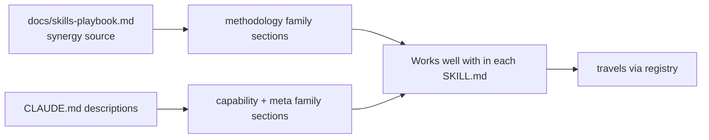

# Plan: "Works well with" retrofit across toolbox skills

## Purpose

Make every toolbox skill self-describe how it composes with its neighbors, so that synergy survives registry distribution. Today a downstream project that registers one skill sees only that skill's own directory — `CLAUDE.md` and `docs/skills-playbook.md` do **not** travel. The only durable channel for "this works well with X" is a section inside each `SKILL.md`. This plan retrofits that section across the existing skills, applying the three-tier skill-awareness model already established and demonstrated in `living-plan`.

> **Definition of Done:** this plan is complete when every box below is `[x]` and the global Validation Commands pass. The Purpose + those commands are the fixed goal — changing them requires an Amendments entry.

## Problem

The three-tier skill-awareness model is decided (hard `requires` in `registry.yaml` · soft `## Works well with` in each SKILL.md · local Scenarios in repo docs), but only `living-plan` implements it. The other ~20 skills are silent about their collaborators, so:

- A registered skill gives a downstream consumer no hint that, say, `grill-with-docs` pairs with `tdd` or that `build` delegates to `tdd`.
- The synergy knowledge currently lives only in `docs/skills-playbook.md` (methodology family) and the freshly-added `CLAUDE.md` Scenarios section — neither travels with a skill.
- Those two local docs now partially duplicate each other (see Questionables).

## Solution

Derive each skill's soft-synergy section from the existing source of truth (`docs/skills-playbook.md` for the methodology family; `CLAUDE.md` skill descriptions for the capability/meta families), standardize a single section format, and append it to each `SKILL.md`. Reconcile the tier-3 docs so there is one source of truth for scenarios. Hard `requires` stays in `registry.yaml` and is out of scope here (no skill currently needs a new hard dep).

## Relevant Files

### Existing Files
- `docs/skills-playbook.md` — synergy source of truth for the methodology family; do not duplicate, derive from it
- `CLAUDE.md` — three-tier model + Scenarios; the Scenarios section must be reconciled with the playbook
- `skills/living-plan/SKILL.md` — the reference implementation of the `## Works well with` section; match its format and graceful-degradation wording
- `skills/*/SKILL.md` — the ~20 targets of the retrofit

### New Files
- (none — this is an edit-in-place retrofit)

## Implementation Phases

**IMPORTANT:** Execute every phase and task step by step, in order, top to bottom.

### `[x]` Phase 1: Standardize the section format

Lock the canonical shape of the section so all retrofits are consistent.

#### 1. Extract the canonical template and lock the listing discipline
- `[x]` Copy the `## Works well with` structure from `skills/living-plan/SKILL.md` as the format model — heading `## Works well with` **verbatim** (for `grep -rl` across the toolbox), intro line stating optional + graceful degradation, then a bullet per collaborator: **name** — what it hands off / when
- `[x]` Apply the **listing discipline** (resolved via grill):
  - **Altitude:** the section holds **pairwise adjacency only** (who I hand off to / when). Multi-step recipes stay in `docs/skills-playbook.md`; `CLAUDE.md` Scenarios is a pointer. No duplication across layers.
  - **Self-contained:** the section never points out to `docs/skills-playbook.md` (it would dangle once the skill is registered downstream). One-way only: playbook → skills.
  - **Scope:** skills only — agents inherit synergy through their backing skill, so they get no section.
  - **Skip standalone:** a skill with no real toolbox collaborator gets **no section** (absent = "no notable neighbors"); do not author an empty/standalone block.
  - **Primitives don't enumerate consumers:** a core skill (`browser`, `elevenlabs`) mentions its family in one line; consumers point up to the primitive. Avoids edit-the-primitive-on-every-new-consumer churn.
  - **Asymmetry allowed:** list a neighbor from whichever side the handoff is meaningful; no forced mirror entries.

#### 2. Testing Strategy

Behaviors to verify through the public interface:
- `[x]` A skill's section names only collaborators that exist in `skills/` or `agents/` — verified by cross-checking each name against the inventory
- `[x]` Every collaborator mention states graceful degradation (skill still runs if the neighbor is absent) — verified by reading each bullet

Shell validation for this phase:
- `[x]` `ls skills/living-plan/SKILL.md` — the reference implementation exists to copy from

🔁 **Do not exit this phase until every box above is checked.** If a command fails, fix the cause and re-run — loop until all pass.

### `[x]` Phase 2: Retrofit the methodology family

Highest-synergy group; derive from `docs/skills-playbook.md`.

#### 1. Add sections (one task per skill)
- `[x]` `grill-me` — pairs with `grill-with-docs`, `living-plan`, `diagnose` (disambiguate first), `tdd`
- `[x]` `grill-with-docs` — pairs with `grill-me`, `setup-toolbox-context` (CONTEXT.md/ADR substrate), `living-plan`, `tdd`, `improve-codebase-architecture`; note it is what *writes* ADRs
- `[x]` `tdd` — pairs with `grill-with-docs`, `living-plan` (build delegates here), `diagnose`, `setup-toolbox-context`
- `[x]` `diagnose` — pairs with `grill-me` (nail the failure mode first), `tdd` (regression test the fix)
- `[x]` `improve-codebase-architecture` — pairs with `setup-toolbox-context`, `zoom-out`, `grill-with-docs`
- `[x]` `zoom-out` — pairs with `improve-codebase-architecture`, `setup-toolbox-context`, `living-plan`
- `[x]` `setup-toolbox-context` — the substrate; pairs with `grill-with-docs`, `improve-codebase-architecture`, `living-plan`, `tdd`, `zoom-out`
- `[x]` `handoff` — orthogonal context-transfer utility; references `living-plan` plans and pairs with `fork-terminal`

#### 2. Testing Strategy

Behaviors to verify through the public interface:
- `[x]` Each section's relationships match a recipe or mention in `docs/skills-playbook.md` — verified by tracing each back to the playbook
- `[x]` Bidirectional consistency: if A says "pairs with B", B's section (if it has one) acknowledges A — verified by spot-checking pairs

Shell validation for this phase:
- `[x]` `grep -L "Works well with" skills/{grill-me,grill-with-docs,tdd,diagnose,improve-codebase-architecture,zoom-out,setup-toolbox-context,handoff}/SKILL.md` — prints nothing when all eight have the section

🔁 **Do not exit this phase until every box above is checked.** If a command fails, fix the cause and re-run — loop until all pass.

### `[x]` Phase 3: Retrofit the capability + meta families

#### 1. Add sections (grouped by family)
- `[x]` browser family — `browser` (core, used by `browser-workflow`/`browser-review`/`browser-microscope` and the `browser-operator`/`browser-qa` agents); `browser-microscope`, `browser-review`, `browser-workflow` each point back at `browser`
- `[x]` audio family — `elevenlabs` (provider for `speak`, drives `elevenlabs-operator`/`elevenlabs-voice-designer` agents); `speak` (falls back through `elevenlabs` → macOS say, drives `speak-narrator`)
- `[x]` image — `gen-image` (drives `gen-image-operator`)
- `[x]` standalone-ish — `doc-cache`, `menu-app`, `fork-terminal` (pairs with `handoff`), `caveman` (orthogonal mode, pairs with anything): add a section only where a real collaborator exists; otherwise skip and note "no soft synergies"
- `[x]` meta — `skill-forge` (pairs with `skill-guide`, `registry`); `skill-guide` (pairs with `skill-forge`)

#### 2. Testing Strategy

Behaviors to verify through the public interface:
- `[x]` Every named collaborator resolves to a real skill or agent — verified against the inventory
- `[x]` Skills with genuinely no collaborator are left without a forced/empty section — verified by review

Shell validation for this phase:
- `[x]` `grep -rl "Works well with" skills/ | wc -l` — count matches the number of skills that should have a section

🔁 **Do not exit this phase until every box above is checked.** If a command fails, fix the cause and re-run — loop until all pass.

### `[x]` Phase 4: Reconcile tier-3 docs

#### 1. Single source of truth for scenarios + cement the convention
- `[x]` Trim the `CLAUDE.md` Scenarios section to a **one-line pointer** at `docs/skills-playbook.md` (resolved via grill — playbook is the recipe source of truth; Scenarios duplicated it)
- `[x]` Add `living-plan`'s flows to `docs/skills-playbook.md` (it predates the new skill, so the recipes don't mention it — e.g. the grill→plan→build→tdd chain and the plan-first-strawman flow)
- `[x]` Add an explicit **mandate** to `CLAUDE.md`: new toolbox skills MUST include a `## Works well with` section per the three-tier model (today it describes the model but doesn't require it of new skills). This is the enforcement point — `skill-forge` stays portable and is NOT modified, since the convention is toolbox-local, not part of the agentskills.io universal spec.

#### 2. Testing Strategy

Behaviors to verify through the public interface:
- `[x]` Scenario content is not duplicated between `CLAUDE.md` and `docs/skills-playbook.md` — verified by diffing the two for overlapping recipes
- `[x]` `docs/skills-playbook.md` references `living-plan` in its workflows — verified by grep

Shell validation for this phase:
- `[x]` `grep -c "living-plan" docs/skills-playbook.md` — returns ≥ 1

🔁 **Do not exit this phase until every box above is checked.** If a command fails, fix the cause and re-run — loop until all pass.

## Validation Commands

Run these to validate the entire plan is complete:
- `[x]` `grep -rL "Works well with" skills/*/SKILL.md` — lists only the skills intentionally without collaborators (cross-check against the Phase 3 "no synergies" decision)
- `[x]` `for d in $(grep -rl "Works well with" skills/); do echo "$d"; done` — every listed skill's collaborators exist in `skills/` or `agents/`
- `[x]` `grep -c "living-plan" docs/skills-playbook.md` — returns ≥ 1
- `[x]` Task #1 in the session task list is marked complete

🔁 **The plan is not complete until every box is checked and every command passes.** If a step is genuinely impossible, mark it `[f]`, record why in Notes, and move on.

## Questionables
<!-- All resolved via a grill-me pass on 2026-06-22 — kept for the decision record. -->
- **✅ RESOLVED — Do agents get a section too?** → **Skills-only.** Agents inherit synergy through their backing skill; a section on both would duplicate the adjacency list.
- **✅ RESOLVED — Scenarios duplication (`CLAUDE.md` vs playbook).** → No real duplication once layers are split by **altitude**: SKILL.md = pairwise adjacency (travels), playbook = multi-step recipes (local source of truth), `CLAUDE.md` Scenarios = one-line pointer. Phase 4 trims Scenarios to the pointer. Not load-bearing enough for an ADR.
- **✅ RESOLVED — Section heading.** → `## Works well with` verbatim, for toolbox-wide grep-ability.
- **✅ RESOLVED — Convention enforcement (added in grill).** → Enforce via `CLAUDE.md` mandate; keep `skill-forge` portable (the convention is toolbox-local, not agentskills.io-universal).

## Notes

Derived from `docs/skills-playbook.md` (methodology synergies) and `CLAUDE.md` skill descriptions (capability/meta). The playbook predates `living-plan`, so it does not yet mention it — Phase 4 fixes that.

**Write-ownership for execution:** single-writer. This is a one-developer retrofit, not a swarm; no orchestration needed. If parallelized later (one agent per family), each agent owns its own family's `SKILL.md` files — no two agents touch the same file, so per-file ownership avoids conflicts without an orchestrator.

**No `CONTEXT.md` in the toolbox** — this plan is authored in plain language. Running `setup-toolbox-context` would let future toolbox plans speak a sharpened domain vocabulary, but it is not required here.

This plan was produced by running `living-plan` on itself (dogfood). Template friction observed during authoring is logged in the first Amendment.

## Amendments
<!-- Append-only. Newest at the bottom. A change to Purpose/Definition of Done MUST be logged here. -->
- **2026-06-22T15:02:36-0400 — Dogfood authoring notes**: Plan created by running `living-plan/create-plan` against the deferred retrofit task. Template held up; two minor friction points noted for a future skill tweak — (1) the template has no dedicated field for linking to an external *source of truth* doc that isn't a plan/ADR (used `back_refs` with a parenthetical label as a workaround), and (2) "context: [toolbox]" is the repo name rather than a CONTEXT.md-defined context, since the toolbox has no CONTEXT.md. Neither blocks use.
- **2026-06-22T15:14:33-0400 — Folded in grill-me resolutions**: Ran `grill-me` on the Questionables. Resolved all four open decisions (altitude separation, skills-only, self-contained sections, listing discipline, convention enforcement) and marked them in Questionables. Phase 1 gained the explicit listing discipline; Phase 4 gained the concrete Scenarios-pointer trim, the `living-plan` playbook update, and a new task to add the "new skills must include a Works well with section" mandate to `CLAUDE.md` (keeping `skill-forge` portable). Goal/Definition of Done unchanged.
- **2026-06-22T15:20:33-0400 — Built (all phases complete)**: Added `## Works well with` to 18 skills (8 methodology, 10 capability/meta); skipped `doc-cache`, `gen-image`, `menu-app` as standalone per the listing discipline. Reconciled docs: trimmed `CLAUDE.md` Scenarios to a pointer + added the new-skill mandate; inserted the `living-plan` recipe and quick-reference into `docs/skills-playbook.md`. All validation gates green (19 skills with sections, 0 broken skill references; `registry` is an external-but-real soft reference). **Build observation (dogfood):** markers were flipped in a single batch at the end rather than live per task — fine for this single-writer run, but the swarm use-case needs live `[wip]`/`[x]` updates for the ledger to be readable mid-flight. Candidate guidance for a future `build-plan` tweak: prescribe live flipping only when the plan's Notes declare a multi-writer/swarm ownership model.
